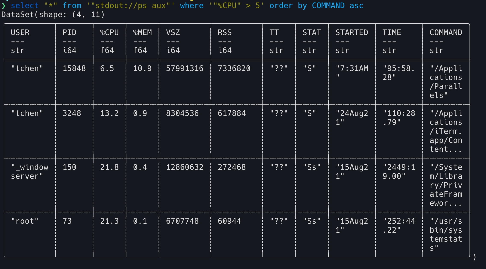

# "select" command line tool

"select" is a command line tool to allow you to run SQL query against local file, remote url and command output. This is a very early tool for experimental purpose. It might fail to parse your command, file, etc.

Examples:

Query with command:


Query with local file:


Query with remote file:


currently only csv files/urls are supported. For command output, I did a hack to retrieve columns through awk then convert it to csv, so the result might be incorrect.

## How to install

```bash
git clone https://github.com/tyrchen/select
cargo build --release
cp target/release/select <YOUR_PATH>
```

Then you can run "select ...".

Note that in bash/zsh/fish, you need to quote "*", and also quote operators like ">", "<". If you want to carry quote to the sql statement, you need to do something like '"%CPU" > 10' this.

Have fun!
